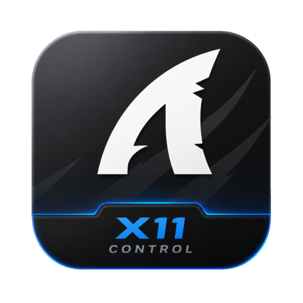

<div align="center">
  
  <h1>OpenSharkX11</h1>
  <p>Native Linux configurator for the <strong>Attack Shark X11</strong> mouse</p>

  <p>
    
    
    
    
  </p>
</div>


# OpenSharkX11
## Attack Shark X11 — Native Linux Configurator

`OpenSharkX11` is an advanced fork and re-engineering of the driver for the **Attack Shark X11** gaming mouse, providing full hardware control in Linux environments.

---

## 🛠 Project Architecture
* **Driver Core**: TypeScript implementation of the USB HID protocol (Report ID 0x03xx).
* **Communication**: Direct `/dev/hidraw` interaction via `libusb`.
* **Runtime**: Electron + React (UI).
* **Persistence**: Localized file system (`~/.config/opensharkx11/`).

---

## 🏗 Key Features

### Original Implementation (by HarukaYamamoto0)
* Initial HID protocol research for the Attack Shark X11.
* Fundamental DPI and Polling Rate controls.

### Improvements & Fork Features (by Clevs & Heysh1n)
* **Macro Library**: Transitioned from a single-buffer model to a file-based library (`~/.config/opensharkx11/macros/*.json`).
* **Hardware Buffer Management**: Smart injection logic to push selected macros into the hardware's single-event buffer (automatically handles binding conflicts).
* **Custom UI**:
    * Dynamic accent color system (supports `DYNAMIC` custom colors via `localStorage`).
    * Full-featured Macro Editor with a timeline, delay tuning, and mapping to any HID key code.
* **Localization**: Full support for EN, RU, TR, PT, ZH, ES, DE, KO, JA.
* **CI/CD & Updates**: Automated GitHub Actions builds (AppImage/DEB) and integrated `electron-updater` for seamless patching.
* **SFC PRO Integration**: Built-in support for context-aware code collection.

---

## ⚙️ Installation

### 1. Udev Rules (REQUIRED)
Grant non-root access to your device by creating the following rules:
```bash
sudo nano /etc/udev/rules.d/99-attack-shark-x11.rules

```

Paste the following:

```text
SUBSYSTEM=="usb", ATTR{idVendor}=="1d57", ATTR{idProduct}=="fa60", MODE="0666", GROUP="plugdev", TAG+="uaccess"
SUBSYSTEM=="hidraw", ATTRS{idVendor}=="1d57", ATTRS{idProduct}=="fa60", MODE="0666", GROUP="plugdev", TAG+="uaccess"
SUBSYSTEM=="usb", ATTR{idVendor}=="1d57", ATTR{idProduct}=="fa55", MODE="0666", GROUP="plugdev", TAG+="uaccess"
SUBSYSTEM=="hidraw", ATTRS{idVendor}=="1d57", ATTRS{idProduct}=="fa55", MODE="0666", GROUP="plugdev", TAG+="uaccess"

```

Apply the changes:

```bash
sudo udevadm control --reload-rules && sudo udevadm trigger

```

### 2. Build from Source

```bash
git clone https://github.com/Heysh1n/OpenSharkX11
cd OpenSharkX11
npm install
npm run dist

```

---

## 📋 License

* Original Driver: MIT (HarukaYamamoto0)
* Fork & Enhancements: MIT (Clevs, Heysh1n)


<p align="center">
  Made with ❤️ by Heysh1n
</p>